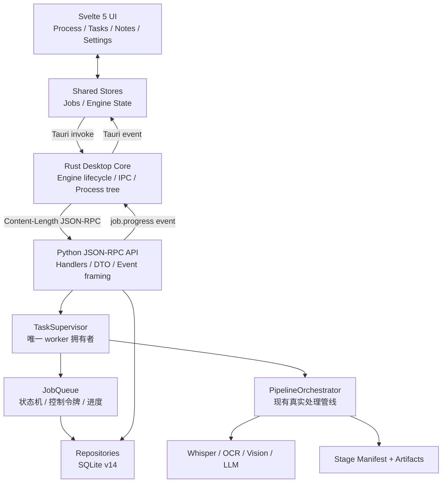

# Video Notes AI 产品级架构 v4

> 状态：本轮重构后的可执行基线
> 适用范围：Tauri 2 + Svelte 5 桌面端、Python Sidecar、真实视频处理任务
> 核心原则：不重写 Whisper/OCR/LLM 业务管线，只收敛任务生命周期、IPC、持久化与界面状态边界

## 1. 本轮解决的问题

旧实现的主要风险不是算法本身，而是任务执行存在多入口、多份状态和不完整恢复信息：

- 新建、继续和重试分别创建线程，容易出现重复 worker。
- SQLite 只保存任务结果和阶段，未保存完整非密钥参数。
- 继续任务可能回到当前默认模型、模板、视觉参数和输出设置。
- 前端部分调用绕过统一 `engine_call`，按钮参数与后端契约不一致。
- Python 进度未形成“持久化事件 + 实时推送”的统一链路。
- Rust 在等待长 RPC 时持有引擎生命周期锁，暂停和查询可能被阻塞。
- Python `stderr` 未持续消费时存在管道写满后侧车卡住的风险。
- 引擎启动阶段导入可选重依赖，缺少某个组件可能导致整个桌面壳无法启动。
- 模板资产缺失时，模板列表、推荐和预览整条功能不可用。
- 设置页与 Python API 的供应商、模型和诊断契约不一致。

v4 将这些问题收敛为一套可长期演进的产品骨架。

## 2. 总体架构



唯一业务调用链：

```text
Svelte -> Tauri command -> Rust EngineClient -> Python JSON-RPC handler
       -> TaskSupervisor -> JobQueue / PipelineOrchestrator
```

唯一进度链：

```text
Pipeline stage callback
-> JobQueue 持久化 progress / heartbeat
-> EventJournal 写入 job_events
-> Python job.progress 通知
-> Rust 转发 params
-> Svelte jobs store
-> Process / Tasks 页面同步更新
```

## 3. 分层职责

### 3.1 Svelte 表现层

职责：

- 收集任务参数。
- 显示任务列表、阶段、进度、错误和产物。
- 发起开始、暂停、取消、继续、从头重试。
- 订阅统一 `job.progress` 事件。
- 通过共享 jobs store 驱动多个页面。

禁止：

- 直接读写 SQLite。
- 直接操作 `.jobs` 工作区。
- 自己推断任务已经完成。
- 在 Process 页面和 Tasks 页面分别维护独立任务真相。
- 绕过 `engine_call` 使用散落的 Tauri invoke。

### 3.2 Rust 桌面核心

职责：

- 启动、检测和关闭 Python Sidecar。
- 使用 Content-Length 帧传输 JSON-RPC。
- 将响应路由到对应请求。
- 将无 `id` 通知转发为 Tauri 事件。
- 持续消费 Python `stderr`。
- 引擎退出时立即使所有待处理 RPC 失败。
- Windows 下通过 Job Object 管理进程树。

关键约束：

- `EngineManager` 只管理进程生命周期。
- `EngineClient` 持有可克隆 stdin 与 pending map。
- 长 RPC 等待期间不持有 `Mutex<EngineManager>`。
- stdin 写入串行化。
- 最大单帧为 8 MiB。
- 开发模式从项目根目录执行 `python -m src.engine --stdio`。
- 可通过 `VIDEO_NOTES_PYTHON`、`VIDEO_NOTES_PROJECT_ROOT`、`VIDEO_NOTES_ENGINE` 和 `VIDEO_NOTES_ENGINE_CWD` 覆盖启动方式。

### 3.3 Python API 层

职责：

- 提供稳定方法名和参数校验。
- 将异常转换为 JSON-RPC 错误。
- 构建 `PipelineRequest`。
- 提供任务、笔记、合集、设置和诊断接口。
- 发送协议事件，但不执行任务线程管理。

任务方法：

| 方法 | 语义 |
|---|---|
| `process.start` | 创建新任务并启动 |
| `process.pause` | 请求在安全检查点暂停 |
| `process.cancel` | 请求取消并按策略清理 |
| `process.resume` | 使用同一 `run_id` 和已有阶段产物继续 |
| `process.retry` | 新建 `run_id`，从头执行，并记录来源任务 |
| `process.list` | 分页查询持久化任务 |
| `process.get` | 获取单个任务 |
| `process.events` | 从指定 `event_id` 后补取事件 |
| `process.delete` | 隐藏或删除任务记录 |
| `process.permanent_clean` | 清理已隐藏历史 |

### 3.4 TaskSupervisor

`TaskSupervisor` 是唯一允许创建处理线程的组件。

职责：

- 统一 `start` / `resume` / `retry`。
- 防止同一任务被重复启动。
- 首版限制一个重任务同时执行，避免 Whisper、OCR、视觉模型和 GPU 显存争抢。
- worker 结束后清理线程表。
- 将成功、取消和异常收敛到 `JobQueue`。
- 从请求快照重建原任务。

语义：

- **继续任务（resume）**：沿用原 `run_id`、工作区和有效 stage manifest，只补做未完成阶段。
- **从头重试（retry）**：创建新 `run_id`，`attempt + 1`，写入 `parent_run_id`，并以 `force=True` 从头执行。
- **新建任务（start）**：先持久化请求快照，再启动 worker。

### 3.5 JobQueue 与状态机

持久化状态：

```text
pending
  -> running / resolving / downloading / transcribing
  -> extracting_frames / generating_notes / indexing
  -> completed
```

控制状态：

```text
running -> pausing -> paused
running -> cancelling -> cancelled
```

异常状态：

```text
running -> failed
引擎进程消失后，遗留 running/pausing/cancelling -> interrupted
```

可继续状态：

- `pending`
- `running`，兼容旧记录；引擎启动时会先归一为 `interrupted`
- `paused`
- `failed`
- `interrupted`

不可继续状态：

- `completed`
- `cancelled`，只允许从头重试

数据库同时保存：

- `progress`
- `progress_message`
- `heartbeat_at`
- `last_active_stage`
- `interrupted_at`
- `request_json`
- `attempt`
- `parent_run_id`

## 4. 断点恢复设计

### 4.1 两层恢复依据

恢复不能只看数据库状态，也不能只看文件是否存在。v4 使用两层依据：

1. **任务请求快照**：决定恢复时使用什么参数。
2. **阶段 manifest**：决定哪些阶段产物经过完整性验证，可以跳过。

### 4.2 请求快照

每个任务在入队前保存版本化 JSON：

```json
{
  "schema_version": 1,
  "request": {
    "input": "...",
    "whisper_model": "...",
    "provider": "...",
    "gpt_model": "...",
    "template_id": "...",
    "frame_mode": "...",
    "max_frames": 80,
    "vision_enabled": true
  },
  "credential_refs": {
    "llm_profile": "生产模型",
    "vision_profile": "视觉模型"
  },
  "secret_policy": "named_profile_or_environment"
}
```

明确不保存：

- LLM API Key
- Vision API Key
- Bilibili cookies
- 其他原始凭据

恢复时：

1. 非密钥参数以历史快照为准。
2. 凭据优先从原任务记录的“供应商配置名称”解析。
3. 旧快照无名称时，回退到当前绑定配置。
4. 配置内无密钥时再读取环境变量。
5. 密钥可轮换，不需要修改历史任务行。

### 4.3 阶段 manifest

每个可恢复阶段写入 manifest：

- stage
- completed / partial
- 输出文件列表
- 输入哈希
- 格式版本
- 时间
- partial 错误

只有状态为 `completed`、输出存在且非空、并满足阶段校验时，恢复才跳过该阶段。旧 manifest 路径仍兼容读取。

### 4.4 进程崩溃恢复

启动时：

- 将上一个进程遗留的活动状态标记为 `interrupted`。
- 保留工作区、快照、阶段 manifest 和事件历史。
- 前端展示“继续任务”。
- 继续时使用同一任务及原配置，不重新提取已经验证完成的音频或转录。

## 5. 事件模型

数据库事件表 `job_events` 保存：

- `event_id`
- `job_id`
- `run_id`
- `event_type`
- `stage`
- `progress`
- `message`
- `payload_json`
- `created_at`

实时事件统一使用 `job.progress`：

```json
{
  "job_id": "...",
  "run_id": "...",
  "status": "running",
  "stage": "transcribing",
  "progress": 42,
  "message": "正在转录",
  "event_id": 123
}
```

实时订阅统一使用 `job.progress`。终端事件仍以 `event_type` 持久化为 `completed`、`failed`、`interrupted`、`paused` 或 `cancelled`，前端不需要建立多套监听。

## 6. 数据与文件布局

用户可见输出目录：

```text
output/
  notes/
  transcripts/
  frames/
  .note_index/
```

私有任务工作区：

```text
%LOCALAPPDATA%/Video Notes AI/.jobs/
  <job_id>/
    request.json
    stages/
    artifacts/
    temp/
```

原则：

- 可恢复产物放 `artifacts`。
- 可重新生成的中间产物放 `temp`。
- 抽帧工作目录为任务私有，禁止多个任务共享全局临时目录。
- 完成后按现有保留策略清理临时文件。
- 取消与失败不应删除可用于诊断或恢复的阶段产物。

## 7. 前端状态设计

前端 jobs store 是唯一任务视图来源：

- Process 页面提交新任务并订阅当前任务。
- Tasks 页面读取同一 store。
- 事件到达后只更新 store，不在各页面复制状态机。
- 页面刷新后通过 `process.list` 与 `process.events` 补齐状态。

允许操作：

| 状态 | 操作 |
|---|---|
| pending | 继续 / 取消 |
| running | 暂停 / 取消 |
| failed | 继续 / 从头重试 / 删除 |
| paused | 继续 / 取消 |
| interrupted | 继续 / 从头重试 / 删除 |
| completed | 打开笔记 / 删除 |
| cancelled | 从头重试 / 删除 |

## 8. 设置、模板与诊断

### 8.1 设置 API

设置写入使用原子更新，支持新 `patches` 结构并兼容旧结构。供应商契约统一支持：

- list
- create
- update
- delete
- set_active
- scan_models
- test_connection

连接测试只进行轻量可达性或认证检查，不主动生成内容。

### 8.2 模板资产

内置模板必须随 Sidecar 一起打包：

- 通用笔记
- 学习笔记
- 会议纪要
- 编程教程
- 课程讲座
- 访谈整理
- 产品演示
- 论文研读

模板 API 提供列表、推荐、预览、校验和加载，不依赖前端硬编码。

### 8.3 诊断

- 缺少 yt-dlp、Whisper、OCR 或其他可选组件时，桌面壳仍能启动。
- `doctor.run` 返回 pass / warn / fail。
- 问题报告只导出安全诊断信息。
- 不导出完整环境变量或明文 API Key。

## 9. 安全边界

- stdout 只允许 Content-Length JSON-RPC 帧。
- Python 普通日志写 stderr 或文件。
- 控制台直跑模式可显式开启进度打印，Sidecar 模式关闭。
- 请求快照和事件日志不得写密钥。
- 前端永远只得到脱敏后的供应商信息。
- 诊断包不得包含完整环境变量。

## 10. 当前产品能力边界

- 同时只运行一个重任务。
- Python worker 仍为进程内线程，不是独立 worker 进程池。
- 组件下载、模型管理、自动更新和签名发布尚未纳入本轮。
- 正式生产代码已不再导入 `src.core`；仓库仍保留少量历史注释和旧 Qt 测试，后续需要归档。
- 旧 Qt 测试仍存在于仓库，但对应 GUI 已退出正式产品链。

## 11. 后续演进路线

### 阶段 1：当前 v4 基线

- TaskSupervisor 单一入口。
- SQLite v14。
- 参数快照与凭据引用。
- 事件日志与前端共享任务状态。
- 设置、模板和诊断契约统一。

### 阶段 2：发布工程化

- Windows 上完成 `cargo check`、`cargo test`、`tauri build`。
- 使用 PyInstaller/Nuitka 生成 `python-engine.exe`。
- 验证 Tauri `externalBin` 命名为 target triple。
- 验证 CPU-only 与 CUDA 两套安装策略。
- 对真实本地视频、URL、暂停、强杀、继续、重试执行端到端测试。
- 建立日志轮转和一键诊断包。

### 阶段 3：多任务与独立 worker

- 将重任务移动到独立 worker 进程池。
- 增加 GPU/CPU 队列调度。
- 主引擎重启后自动重连或显式恢复。

### 阶段 4：组件化发布

- Shell 自动更新。
- Engine 独立版本。
- Whisper/OCR/CUDA 组件清单。
- 哈希、签名、回滚和离线缓存。
- 数据库迁移备份与回滚策略。

## 12. 正式发布门禁

以下项目全部通过后，才可称为“可公开发布版本”：

1. Python 活跃测试套件通过。
2. Svelte build 与 svelte-check 通过。
3. Rust fmt、check、test 通过。
4. Tauri Windows 安装包构建通过。
5. 打包后的 Sidecar 能完成 `system.info` 和 `system.shutdown`。
6. CUDA Whisper 在目标机器上完成真实转录。
7. CPU fallback 行为可控且有明确提示。
8. API Key 不出现在 SQLite、事件日志、前端响应和诊断包。
9. 安装、升级、卸载后用户产物与数据库符合保留策略。
10. 无旧 Qt GUI 进入正式构建产物。
